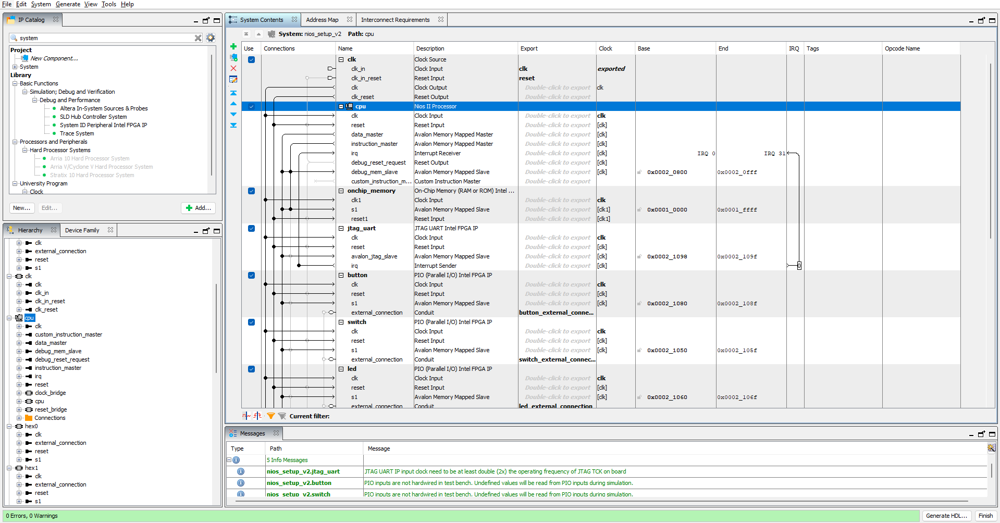
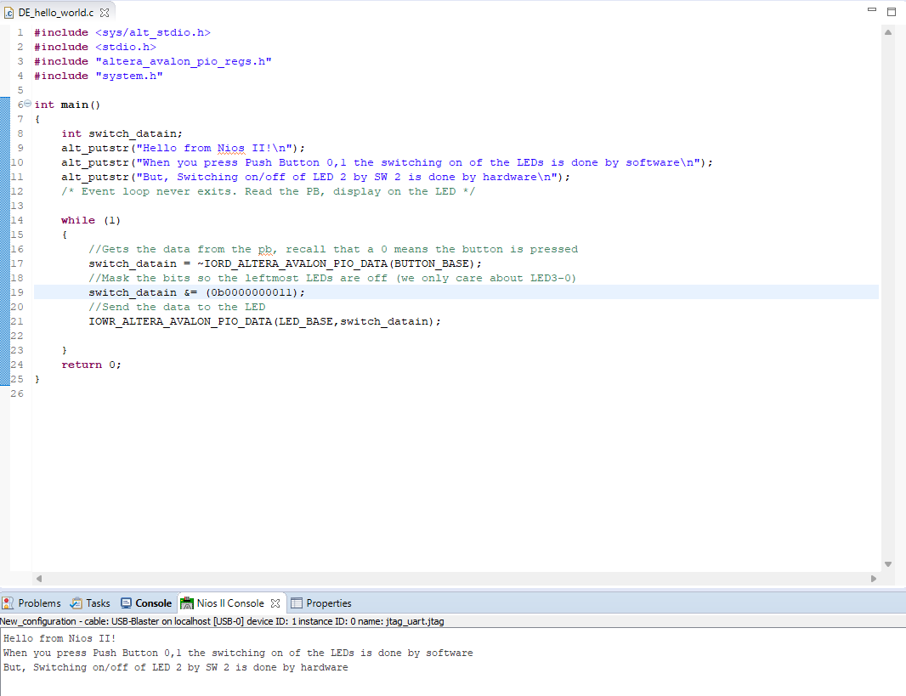
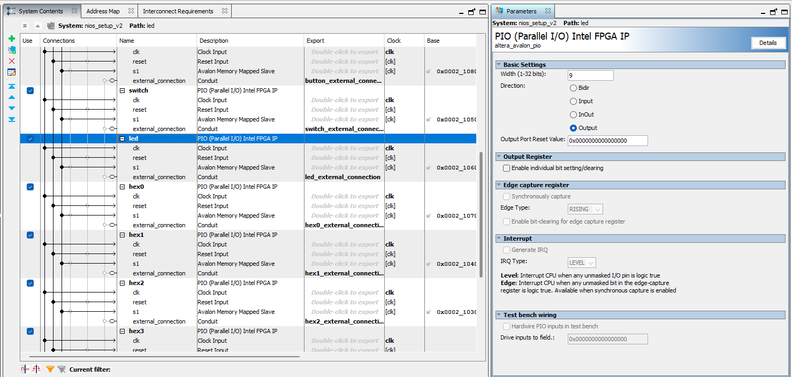
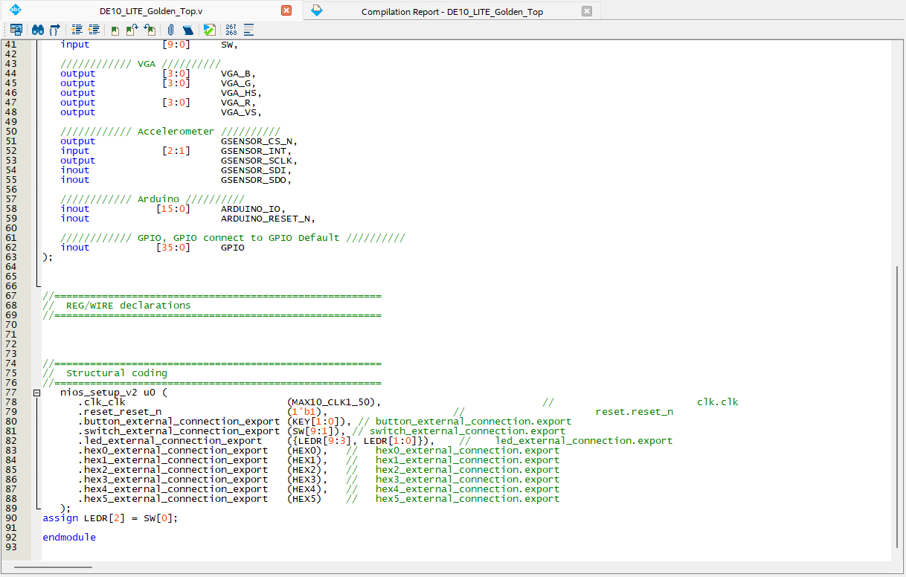
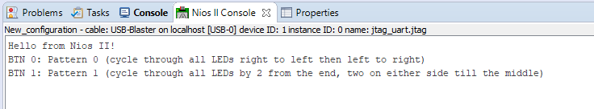

# Lab 2

## Table of Contents

- [Task 1](#task-1)
- [Task 2](#task-2)
- [Challenge](#challenge)

## Task 1



## Task 2






https://github.com/user-attachments/assets/4b456ec4-bb08-4958-8522-67296e74f71a


## Challenge




https://github.com/user-attachments/assets/e0f7734c-381c-4376-9534-f17ca019c4f4


```C
#include <sys/alt_stdio.h>
#include <stdio.h>
#include <stdlib.h>
#include "altera_avalon_pio_regs.h"
#include "system.h"
#define CYCLE_DELAY 500000
int main()
{
 int switch_datain = 0;
 int pattern = -1;
 int pattern_altern = 0;
 alt_putstr("Hello from Nios II!\n");
 alt_putstr("BTN 0: Pattern 0 (cycle through all LEDs right to left then left to right)\n");
 alt_putstr("BTN 1: Pattern 1 (cycle through all LEDs by 2 from the end, two on either side till the middle)\n");

 /* Event loop never exits. Read the PB, display on the LED */
 while (1)
 {
  //Gets the data from the pb, recall that a 0 means the button is pressed

  /*switch_datain = ~IORD_ALTERA_AVALON_PIO_DATA(BUTTON_BASE);
  //Mask the bits so the leftmost LEDs are off (we only care about LED3-0)
  switch_datain &= (0b0000000011);
  //Send the data to the LED
  IOWR_ALTERA_AVALON_PIO_DATA(LED_BASE,switch_datain);
  */
  if ((~IORD_ALTERA_AVALON_PIO_DATA(BUTTON_BASE))&0x1) {
   pattern = 0;
   switch_datain = 0b0000000001;
   pattern_altern = 0;
  } else if ((~IORD_ALTERA_AVALON_PIO_DATA(BUTTON_BASE))&0x2) {
   pattern = 1;
   switch_datain = 0b1000000001;
   pattern_altern = 0;
  }

  if (pattern == 0) {
   for (int x = 0; x < CYCLE_DELAY; x++) {
    IORD_ALTERA_AVALON_PIO_DATA(BUTTON_BASE);
   }
   switch_datain = pattern_altern ? switch_datain >> 1 : switch_datain << 1;
   pattern_altern = (switch_datain==0b1000000000) || (switch_datain==0b0000000001) ? ~pattern_altern : pattern_altern;
  }

  if (pattern == 1) {
   for (int x = 0; x < CYCLE_DELAY; x++) {
    IORD_ALTERA_AVALON_PIO_DATA(BUTTON_BASE);
   }
   switch_datain = pattern_altern ? ((switch_datain&0b1111100000)<<1)|((switch_datain&0b0000011111)>>1) : ((switch_datain&0b1111100000)>>1)|((switch_datain&0b0000011111)<<1);
   pattern_altern = (switch_datain==0b1000000001) || (switch_datain==0b0000110000) ? ~pattern_altern : pattern_altern;
  }

  if (pattern != -1) {
   IOWR_ALTERA_AVALON_PIO_DATA(LED_BASE,switch_datain);
  }
  else {
   IOWR_ALTERA_AVALON_PIO_DATA(LED_BASE, 0);
  }

 }
 return 0;
}
```
