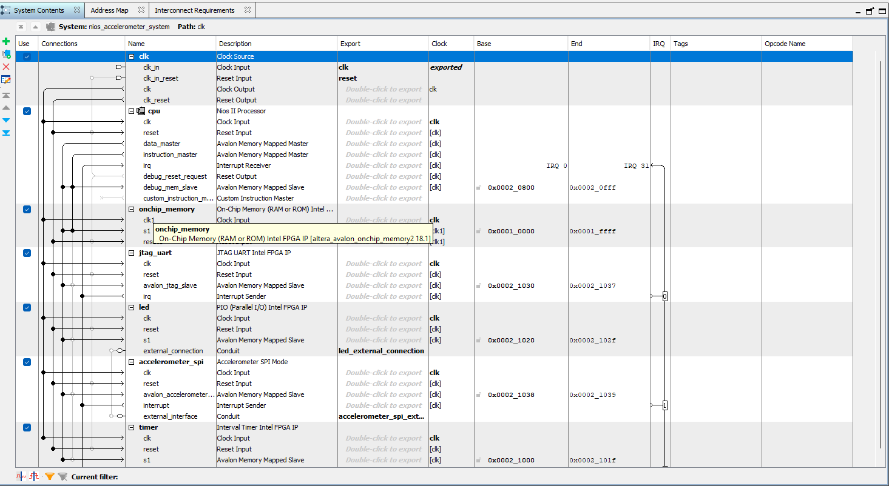
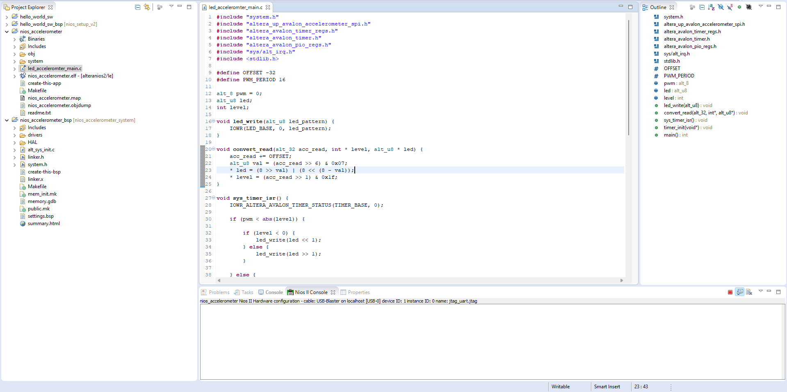

# Lab 3

## Table of Contents

- [Task 1](#task-1)
- [Task 2](#task-2)
- [Task 3](#task-3)

## Task 1




## Task 2

```C
void convert_read(alt_32 acc_read, int * level, alt_u8 * led) {
    acc_read += OFFSET;
    alt_u8 val = (acc_read >> 6) & 0x07; // extracts the top three bits of the x_axis reading: when its positive
    // its 0-3, when its negative its 4-7, with 4 being the most negative
    * led = (8 >> val) | (8 << (8 - val)); // this sets the led with the reflected values, led7-led4 get lit up when the direction
    // is negative, and led3-led0 get set when the direction is positive
    // (8>>val) responsible for positive values, (8<<(8-val)) responsible for negative values
    * level = (acc_read >> 1) & 0x1f; // gives absolute reading of MSB of X axis reading from bit 0 to 4, aka giving the other 5 bits not read by val
}
/*
The writing of the value on the LEDs is performed at a specific rate dictated by the timer. The sys_timer_isr() is an interrupt service routine that is executed when a specific interrupt is received.

As such, the processor will only execute this code at a specific intervals, letting the processor to focus on the execution of the while-loop code.

You can also notice that the code uses pulse width modulation (PWM), which utilizes the convert_read() function, to create a smooth effect on the LEDS, creating a more “pleasant” indicator of the tilted angle of the board.

Using the alt_print() function, you can print on the host terminal the actual values of the x_read.

*/
```

## Task 3

N-tap moving average filter (can be used for 5 or more)

```C
float buf[NO_OF_TAPS];
float fir_filter(alt_32 sampl_value) {
    static int x = 0; // Note that this is a STATIC int
    buf[x%NO_OF_TAPS] = (float)sampl_value;
    x++; // Buffer rolls over with %NO_OF_TAPS term, causing it to store NO_OF_TAPS most recent samples
    float output = 0;
    for (int y = 0; y < NO_OF_TAPS; y++) {
        output += (1.0f/NO_OF_TAPS)*buf[y];
    }
    return output;
}
```

For an N-tap moving average filter of 5:
place video here

For an N-tap moving average filter of 50:
place video here

For an N-tap Low Pass Filter in the example:

```C
float array_of_coeffs[NO_OF_TAPS] = {
        0.0046  ,  0.0074 ,  -0.0024 ,  -0.0071  ,  0.0033 ,   0.0001 ,  -0.0094 ,   0.0040 ,   0.0044 ,  -0.0133 ,   0.0030,
        0.0114  , -0.0179 ,  -0.0011 ,   0.0223  , -0.0225 ,  -0.0109 ,   0.0396 ,  -0.0263 ,  -0.0338 ,   0.0752 ,  -0.0289,
       -0.1204  ,  0.2879 ,   0.6369 ,   0.2879  , -0.1204 ,  -0.0289 ,   0.0752 ,  -0.0338 ,  -0.0263 ,   0.0396 ,  -0.0109,
       -0.0225  ,  0.0223 ,  -0.0011 ,  -0.0179  ,  0.0114 ,   0.0030 ,  -0.0133 ,   0.0044 ,   0.0040 ,  -0.0094 ,   0.0001,
        0.0033  , -0.0071 ,  -0.0024 ,   0.0074  ,  0.0046};
float lpf_fir_filter(alt_32 sampl_value) {

    static int x = 0;
    buf[x%NO_OF_TAPS] = (float)sampl_value;
    x++;
    float output = 0;
    for (int y = 0; y < NO_OF_TAPS; y++) {
        output += array_of_coeffs[y]*buf[(x+y)%NO_OF_TAPS];
    }
    return output;
}
```
place video here

## Challenge: Optimise FIR filter
