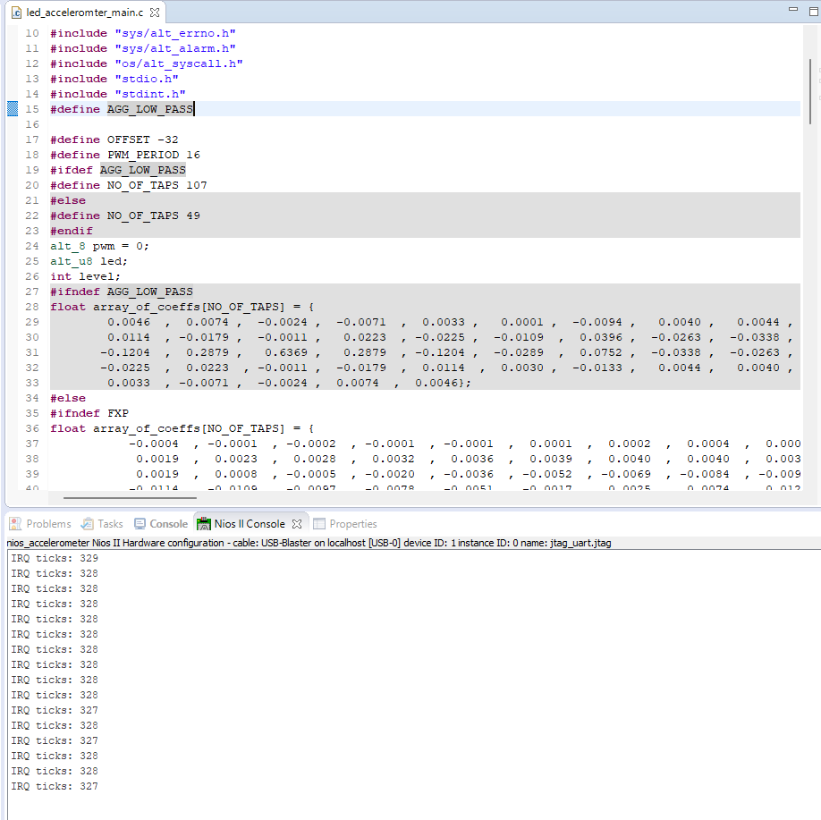
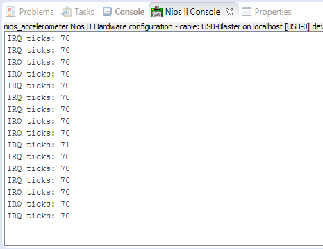

# Lab 3

## Table of Contents

- [Task 1](#task-1)
- [Task 2](#task-2)
- [Task 3](#task-3)
- [Challenge](#challenge-optimise-fir-filter)
- [Code Appendix](#code-appendix)

## Task 1


## Task 2

```C
void convert_read(alt_32 acc_read, int * level, alt_u8 * led) {
    acc_read += OFFSET;
    alt_u8 val = (acc_read >> 6) & 0x07; // extracts the top three bits of the x_axis reading: when its positive
    // its 0-3, when its negative its 4-7, with 4 being the most negative
    * led = (8 >> val) | (8 << (8 - val)); // this sets the led with the reflected values, led7-led4 get lit up when the direction
    // is negative, and led3-led0 get set when the direction is positive
    // (8>>val) responsible for positive values, (8<<(8-val)) responsible for negative values
    * level = (acc_read >> 1) & 0x1f; // gives absolute reading of MSB of X axis reading from bit 0 to 4, aka giving the other 5 bits not read by val
}
/*
The writing of the value on the LEDs is performed at a specific rate dictated by the timer. The sys_timer_isr() is an interrupt service routine that is executed when a specific interrupt is received.

As such, the processor will only execute this code at a specific intervals, letting the processor to focus on the execution of the while-loop code.

You can also notice that the code uses pulse width modulation (PWM), which utilizes the convert_read() function, to create a smooth effect on the LEDS, creating a more “pleasant” indicator of the tilted angle of the board.

Using the alt_print() function, you can print on the host terminal the actual values of the x_read.

*/
```

## Task 3

N-tap moving average filter (can be used for 5 or more)

```C
float buf[NO_OF_TAPS];
float fir_filter(alt_32 sampl_value) {
    static int x = 0; // Note that this is a STATIC int
    buf[x%NO_OF_TAPS] = (float)sampl_value;
    x++; // Buffer rolls over with %NO_OF_TAPS term, causing it to store NO_OF_TAPS most recent samples
    float output = 0;
    for (int y = 0; y < NO_OF_TAPS; y++) {
        output += (1.0f/NO_OF_TAPS)*buf[y];
    }
    return output;
}
```

For an N-tap moving average filter of 5:


https://github.com/user-attachments/assets/854b706f-c43b-497c-9b44-fb3cecd48a61


For an N-tap moving average filter of 50:


https://github.com/user-attachments/assets/a63b6404-4af0-4473-bfbe-6f862352e9f3


For an N-tap Low Pass Filter in the example:

```C
float array_of_coeffs[NO_OF_TAPS] = {
        0.0046  ,  0.0074 ,  -0.0024 ,  -0.0071  ,  0.0033 ,   0.0001 ,  -0.0094 ,   0.0040 ,   0.0044 ,  -0.0133 ,   0.0030,
        0.0114  , -0.0179 ,  -0.0011 ,   0.0223  , -0.0225 ,  -0.0109 ,   0.0396 ,  -0.0263 ,  -0.0338 ,   0.0752 ,  -0.0289,
       -0.1204  ,  0.2879 ,   0.6369 ,   0.2879  , -0.1204 ,  -0.0289 ,   0.0752 ,  -0.0338 ,  -0.0263 ,   0.0396 ,  -0.0109,
       -0.0225  ,  0.0223 ,  -0.0011 ,  -0.0179  ,  0.0114 ,   0.0030 ,  -0.0133 ,   0.0044 ,   0.0040 ,  -0.0094 ,   0.0001,
        0.0033  , -0.0071 ,  -0.0024 ,   0.0074  ,  0.0046};
float lpf_fir_filter(alt_32 sampl_value) {

    static int x = 0;
    buf[x%NO_OF_TAPS] = (float)sampl_value;
    x++;
    float output = 0;
    for (int y = 0; y < NO_OF_TAPS; y++) {
        output += array_of_coeffs[y]*buf[(x+y)%NO_OF_TAPS];
    }
    return output;
}
```

https://github.com/user-attachments/assets/daa131d3-2252-4ace-9928-2fa2d02b0a40

For an N tap filter per the following:
[!Matlab:(](images/Lab3/Task3/task3_1.png)
[!MoreMatlab:(](images/Lab3/Task3/task3_2.png)

```C
float array_of_coeffs[NO_OF_TAPS] = {
   -0.0004  , -0.0001  , -0.0002  , -0.0001  , -0.0001  ,  0.0001  ,  0.0002  ,  0.0004  ,  0.0007  ,  0.0011  ,  0.0014,
    0.0019  ,  0.0023  ,  0.0028  ,  0.0032  ,  0.0036  ,  0.0039  ,  0.0040  ,  0.0040  ,  0.0039  ,  0.0035  ,  0.0028,
    0.0019  ,  0.0008  , -0.0005  , -0.0020  , -0.0036  , -0.0052  , -0.0069  , -0.0084  , -0.0098  , -0.0108  , -0.0114,
   -0.0114  , -0.0109  , -0.0097  , -0.0078  , -0.0051  , -0.0017  ,  0.0025  ,  0.0074  ,  0.0128  ,  0.0187  ,  0.0250,
    0.0314  ,  0.0378  ,  0.0441  ,  0.0500  ,  0.0553  ,  0.0599  ,  0.0637  ,  0.0664  ,  0.0682  ,  0.0687  ,  0.0682,
    0.0664  ,  0.0637  ,  0.0599  ,  0.0553  ,  0.0500  ,  0.0441  ,  0.0378  ,  0.0314  ,  0.0250  ,  0.0187  ,  0.0128,
    0.0074  ,  0.0025  , -0.0017  , -0.0051  , -0.0078  , -0.0097  , -0.0109  , -0.0114  , -0.0114  , -0.0108  , -0.0098,
   -0.0084  , -0.0069  , -0.0052  , -0.0036  , -0.0020  , -0.0005  ,  0.0008  ,  0.0019  ,  0.0028  ,  0.0035  ,  0.0039,
    0.0040  ,  0.0040  ,  0.0039  ,  0.0036  ,  0.0032  ,  0.0028  ,  0.0023  ,  0.0019  ,  0.0014  ,  0.0011  ,  0.0007,
    0.0004  ,  0.0002  ,  0.0001  , -0.0001  , -0.0001  , -0.0002  , -0.0001  , -0.0004
};
```


https://github.com/user-attachments/assets/6dc6293c-8827-479d-8a82-9c2a6af9422d


## Challenge: Optimise FIR filter

Quantising the filter whilst preserving any reasonable performance was a challenge. It was a compromise between filter quality and filter performance. When I tried using 16.16 quantisation, even without any printf messages it was so laggy it took seconds for the board to react to **any** movement. This is because 16.16 multiplies produce a 32.32 product with the upper 32 bits being the integer part.

A 64-bit multiply on a platform with no barrel shifts let alone native multipliers is so expensive it prohibits it.

Hence going for a 32-bit multiply is the only solution possible. Then came the question of how to quantise. I chose 9.7 to preserve the 9 bits being read from the accelerometer, and as any lower and the filter is useless due to the low amount of terms other than -1,0,1 and any higher and the accelerometer data is skewed to the point of non-functionality.

(Floating point version)





https://github.com/user-attachments/assets/cb548ada-8750-404d-b171-e48428974f03


## Code appendix

```C
#include "system.h"
#include "altera_up_avalon_accelerometer_spi.h"
#include "altera_avalon_timer_regs.h"
#include "altera_avalon_timer.h"
#include "altera_avalon_pio_regs.h"
#include "sys/alt_irq.h"
#include <stdlib.h>
#include "alt_types.h"
#include "sys/times.h"
#include "sys/alt_errno.h"
#include "sys/alt_alarm.h"
#include "os/alt_syscall.h"
#include "stdio.h"
#include "stdint.h"
#define AGG_LOW_PASS

#define OFFSET -32
#define PWM_PERIOD 16
#ifdef AGG_LOW_PASS
#define NO_OF_TAPS 107
#else
#define NO_OF_TAPS 49
#endif
alt_8 pwm = 0;
alt_u8 led;
int level;
#ifndef AGG_LOW_PASS
float array_of_coeffs[NO_OF_TAPS] = {
        0.0046  ,  0.0074 ,  -0.0024 ,  -0.0071  ,  0.0033 ,   0.0001 ,  -0.0094 ,   0.0040 ,   0.0044 ,  -0.0133 ,   0.0030,
        0.0114  , -0.0179 ,  -0.0011 ,   0.0223  , -0.0225 ,  -0.0109  ,  0.0396 ,  -0.0263 ,  -0.0338 ,   0.0752 ,  -0.0289,
       -0.1204  ,  0.2879 ,   0.6369 ,   0.2879  , -0.1204 ,  -0.0289  ,  0.0752 ,  -0.0338 ,  -0.0263 ,   0.0396  , -0.0109,
       -0.0225  ,  0.0223  , -0.0011 ,  -0.0179  ,  0.0114  ,  0.0030 ,  -0.0133 ,   0.0044 ,   0.0040 ,  -0.0094 ,   0.0001,
        0.0033  , -0.0071 ,  -0.0024 ,  0.0074  ,  0.0046};
#else
#ifndef FXP
float array_of_coeffs[NO_OF_TAPS] = {
   -0.0004  , -0.0001  , -0.0002  , -0.0001  , -0.0001  ,  0.0001  ,  0.0002  ,  0.0004  ,  0.0007  ,  0.0011  ,  0.0014,
    0.0019  ,  0.0023  ,  0.0028  ,  0.0032  ,  0.0036  ,  0.0039  ,  0.0040  ,  0.0040  ,  0.0039  ,  0.0035  ,  0.0028,
    0.0019  ,  0.0008  , -0.0005  , -0.0020  , -0.0036  , -0.0052  , -0.0069  , -0.0084  , -0.0098  , -0.0108  , -0.0114,
   -0.0114  , -0.0109  , -0.0097  , -0.0078  , -0.0051  , -0.0017  ,  0.0025  ,  0.0074  ,  0.0128  ,  0.0187  ,  0.0250,
    0.0314  ,  0.0378  ,  0.0441  ,  0.0500  ,  0.0553  ,  0.0599  ,  0.0637  ,  0.0664  ,  0.0682  ,  0.0687  ,  0.0682,
    0.0664  ,  0.0637  ,  0.0599  ,  0.0553  ,  0.0500  ,  0.0441  ,  0.0378  ,  0.0314  ,  0.0250  ,  0.0187  ,  0.0128,
    0.0074  ,  0.0025  , -0.0017  , -0.0051  , -0.0078  , -0.0097  , -0.0109  , -0.0114  , -0.0114  , -0.0108  , -0.0098,
   -0.0084  , -0.0069  , -0.0052  , -0.0036  , -0.0020  , -0.0005  ,  0.0008  ,  0.0019  ,  0.0028  ,  0.0035  ,  0.0039,
    0.0040  ,  0.0040  ,  0.0039  ,  0.0036  ,  0.0032  ,  0.0028  ,  0.0023  ,  0.0019  ,  0.0014  ,  0.0011  ,  0.0007,
    0.0004  ,  0.0002  ,  0.0001  , -0.0001  , -0.0001  , -0.0002  , -0.0001  , -0.0004
};
#else

int32_t array_of_coeffs[NO_OF_TAPS] =
    {0, 0, 0, 0, 0, 0, 0, 0, 0, 0, 0, 0, 0, 0, 0, 0, 0, 1, 1, 0, 0, 0, 0, 0, 0, 0, 0, -1, -1, -1, -1, -1, -1, -1, -1, -1, -1, -1, 0, 0, 1, 2, 2, 3, 4, 5, 6, 6, 7, 8, 8, 8, 9, 9, 9, 8, 8, 8, 7, 6, 6, 5, 4, 3, 2, 2, 1, 0, 0, -1, -1, -1, -1, -1, -1, -1, -1, -1, -1, -1, 0, 0, 0, 0, 0, 0, 0, 0, 1, 1, 0, 0, 0, 0, 0, 0, 0, 0, 0, 0, 0, 0, 0, 0, 0, 0, 0};
#endif
#endif
void led_write(alt_u8 led_pattern) {
    IOWR(LED_BASE, 0, led_pattern);
}

void convert_read(alt_32 acc_read, int * level, alt_u8 * led) {
    acc_read += OFFSET;
    alt_u8 val = (acc_read >> 6) & 0x07; // extracts the top three bits of the x_axis reading: when its positive
    // its 0-3, when its negative its 4-7, with 4 being the most negative
    * led = (8 >> val) | (8 << (8 - val)); // this sets the led with the reflected values, led7-led4 get lit up when the direction
    // is negative, and led3-led0 get set when the direction is positive
    // (8>>val) responsible for positive values, (8<<(8-val)) responsible for negative values
    * level = (acc_read >> 1) & 0x1f; // gives absolute reading of MSB of X axis reading from bit 0 to 4, aka giving the other 5 bits not read by val
}
/*
The writing of the value on the LEDs is performed at a specific rate dictated by the timer. The sys_timer_isr() is an interrupt service routine that is executed when a specific interrupt is received.

As such, the processor will only execute this code at a specific intervals, letting the processor to focus on the execution of the while-loop code.

You can also notice that the code uses pulse width modulation (PWM), which utilizes the convert_read() function, to create a smooth effect on the LEDS, creating a more “pleasant” indicator of the tilted angle of the board.

Using the alt_print() function, you can print on the host terminal the actual values of the x_read.

*/
unsigned rpl_ticks = 0; // ticks every 2305 cycles
void sys_timer_isr() {
	rpl_ticks++;
    IOWR_ALTERA_AVALON_TIMER_STATUS(TIMER_BASE, 0);
    if (pwm < abs(level)) {

        if (level < 0) {
            led_write(led << 1);
        } else {
            led_write(led >> 1);
        }

    } else {
        led_write(led);
    }

    if (pwm > PWM_PERIOD) {
        pwm = 0;
    } else {
        pwm++;
    }

}

void timer_init(void * isr) {
    IOWR_ALTERA_AVALON_TIMER_CONTROL(TIMER_BASE, 0x0003);
    IOWR_ALTERA_AVALON_TIMER_STATUS(TIMER_BASE, 0);
    IOWR_ALTERA_AVALON_TIMER_PERIODL(TIMER_BASE, 0x0900);
    IOWR_ALTERA_AVALON_TIMER_PERIODH(TIMER_BASE, 0x0000);
    alt_irq_register(TIMER_IRQ, 0, isr);
    IOWR_ALTERA_AVALON_TIMER_CONTROL(TIMER_BASE, 0x0007);

}
#ifndef FXP
float buf[NO_OF_TAPS];
#else
int buf[NO_OF_TAPS];
#endif
#ifndef FXP
float fir_filter(alt_32 sampl_value) {

    static int x = 0;
    buf[x%NO_OF_TAPS] = (float)sampl_value;
    x++;
    float output = 0;
    for (int y = 0; y < NO_OF_TAPS; y++) {
        output += (1.0f/NO_OF_TAPS)*buf[y];
    }
    return output;
}
#endif
#ifndef FXP
float lpf_fir_filter(alt_32 sampl_value) {

    static int x = 0;
    buf[x%NO_OF_TAPS] = (float)sampl_value;
    x++;
    float output = 0;
    for (int y = 0; y < NO_OF_TAPS; y++) {
        output += array_of_coeffs[y]*buf[(x+y)%NO_OF_TAPS];
    }
    return output;
}
#else
int lpf_fir_filter(alt_32 sampl_value) {
    static int x = 0;
    buf[x%NO_OF_TAPS] = sampl_value;
    x++;
    int32_t output = 0;
    for (int y = 0; y < NO_OF_TAPS; y++) {
        output += (int32_t)array_of_coeffs[y]*(int32_t)buf[(x+y)%NO_OF_TAPS];
    }
    int32_t integer = output >> 14;
    return (int)(integer);
}
#endif
int cast_fxp_to_int(int fxp) {
    int integer = (fxp>>7);
    return integer;
}
int cast_short_to_fxp(int integer) {
    int fxp = integer << 7;
    return fxp;
}
int main() {

    alt_32 x_read;
    alt_up_accelerometer_spi_dev * acc_dev;
    acc_dev = alt_up_accelerometer_spi_open_dev("/dev/accelerometer_spi");
    if (acc_dev == NULL) { // if return 1, check if the spi ip name is "accelerometer_spi"
        return 1;
    }

    timer_init(sys_timer_isr);
    while (1) {
#ifdef FXP
        alt_up_accelerometer_spi_read_x_axis(acc_dev, & x_read);
        unsigned int time1 = rpl_ticks;
        // The code that you want to time goes here
        // some code…
        // till here

        int x_read_f = lpf_fir_filter(cast_short_to_fxp(x_read));
        unsigned int time2 = rpl_ticks;
        printf("IRQ ticks: %d\n", time2-time1);
        x_read = x_read_f;
        convert_read(x_read, & level, & led);
#else
        alt_up_accelerometer_spi_read_x_axis(acc_dev, & x_read);
        unsigned int time1 = rpl_ticks;
        // The code that you want to time goes here
        // some code…
        // till here

        float x_read_f = lpf_fir_filter(x_read);
        unsigned int time2 = rpl_ticks;
        printf("IRQ ticks: %d\n", time2-time1);
        x_read = (int)x_read_f;
        convert_read(x_read, & level, & led);
#endif
    }

    return 0;
}
```


```Python
def float_to_fixed_16_16(value):
    scaling_factor = 2**16
    fixed_value = int(round(value * scaling_factor))
    fixed_value = max(-2147483648, min(2147483647, fixed_value))
    return fixed_value

# Example usage:
floating_values = [ -0.0004  , -0.0001  , -0.0002  , -0.0001  , -0.0001  ,  0.0001  ,  0.0002  ,  0.0004  ,  0.0007  ,  0.0011  ,  0.0014,
            0.0019  ,  0.0023  ,  0.0028  ,  0.0032  ,  0.0036  ,  0.0039  ,  0.0040  ,  0.0040  ,  0.0039  ,  0.0035  ,  0.0028,
            0.0019  ,  0.0008  , -0.0005  , -0.0020  , -0.0036  , -0.0052  , -0.0069  , -0.0084  , -0.0098  , -0.0108  , -0.0114,
           -0.0114  , -0.0109  , -0.0097  , -0.0078  , -0.0051  , -0.0017  ,  0.0025  ,  0.0074  ,  0.0128  ,  0.0187  ,  0.0250,
            0.0314  ,  0.0378  ,  0.0441  ,  0.0500  ,  0.0553  ,  0.0599  ,  0.0637  ,  0.0664  ,  0.0682  ,  0.0687  ,  0.0682,
            0.0664  ,  0.0637  ,  0.0599  ,  0.0553  ,  0.0500  ,  0.0441  ,  0.0378  ,  0.0314  ,  0.0250  ,  0.0187  ,  0.0128,
            0.0074  ,  0.0025  , -0.0017  , -0.0051  , -0.0078  , -0.0097  , -0.0109  , -0.0114  , -0.0114  , -0.0108  , -0.0098,
           -0.0084  , -0.0069  , -0.0052  , -0.0036  , -0.0020  , -0.0005  ,  0.0008  ,  0.0019  ,  0.0028  ,  0.0035  ,  0.0039,
            0.0040  ,  0.0040  ,  0.0039  ,  0.0036  ,  0.0032  ,  0.0028  ,  0.0023  ,  0.0019  ,  0.0014  ,  0.0011  ,  0.0007,
            0.0004  ,  0.0002  ,  0.0001  , -0.0001  , -0.0001  , -0.0002  , -0.0001  , -0.0004]
fixed_values = [float_to_fixed_16_16(v) for v in floating_values]
print(fixed_values)

```
