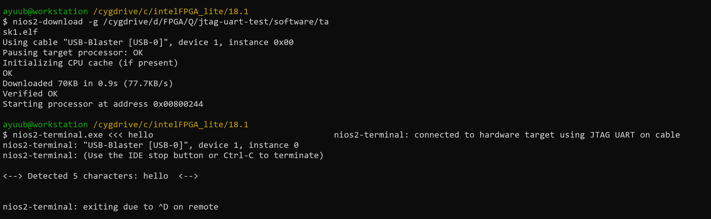
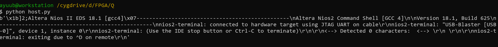
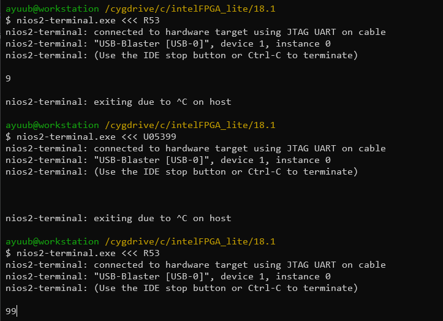

# Lab 3

## Table of Contents

- [Task 1](#task-1)
- [Task 2](#task-2)
- [Challenge](#challenge)
- [Code Appendix](#code-appendix)

## Task 1





## Task 2

```C
void convert_read(alt_32 acc_read, int * level, alt_u8 * led) {
    acc_read += OFFSET;
    alt_u8 val = (acc_read >> 6) & 0x07; // extracts the top three bits of the x_axis reading: when its positive
    // its 0-3, when its negative its 4-7, with 4 being the most negative
    * led = (8 >> val) | (8 << (8 - val)); // this sets the led with the reflected values, led7-led4 get lit up when the direction
    // is negative, and led3-led0 get set when the direction is positive
    // (8>>val) responsible for positive values, (8<<(8-val)) responsible for negative values
    * level = (acc_read >> 1) & 0x1f; // gives absolute reading of MSB of X axis reading from bit 0 to 4, aka giving the other 5 bits not read by val
}
/*
The writing of the value on the LEDs is performed at a specific rate dictated by the timer. The sys_timer_isr() is an interrupt service routine that is executed when a specific interrupt is received.

As such, the processor will only execute this code at a specific intervals, letting the processor to focus on the execution of the while-loop code.

You can also notice that the code uses pulse width modulation (PWM), which utilizes the convert_read() function, to create a smooth effect on the LEDS, creating a more “pleasant” indicator of the tilted angle of the board.

Using the alt_print() function, you can print on the host terminal the actual values of the x_read.

*/
```

## Challenge

### Challenge 1: Updating filter coefficients
This challenge was accomplished by having a non-blocking opcode called 'U' followed by a 3-digit index for the 107-tap filter, and a 2-digit index for the new coefficient. This can be verified by using an 'R' opcode followed by a up to 3 digit index. 



## Code appendix

```C
#include "system.h"
#include "altera_up_avalon_accelerometer_spi.h"
#include "altera_avalon_timer_regs.h"
#include "altera_avalon_timer.h"
#include "altera_avalon_jtag_uart.h"
#include "altera_avalon_jtag_uart_regs.h"
#include "altera_avalon_pio_regs.h"
#include "sys/alt_irq.h"
#include <stdlib.h>
#include "alt_types.h"
#include "sys/times.h"
#include "sys/alt_errno.h"
#include "sys/alt_alarm.h"
#include "os/alt_syscall.h"
#include "stdint.h"
#include <stdio.h>
#include <string.h>
#define CHARLIM 256    // Maximum character length of what the user places in memory.  Increase to allow longer sequences
#define LENLM 2
#define IDXLM 3
#define QUITLETTER '~' // Letter to kill all processing
#define AGG_LOW_PASS
#define FXP
#define OFFSET -32
#define PWM_PERIOD 16
#ifdef AGG_LOW_PASS
#define NO_OF_TAPS 107
#else
#define NO_OF_TAPS 49
#endif
alt_8 pwm = 0;
alt_u8 led;
alt_u8 mode = 0;
int level;
#ifndef AGG_LOW_PASS
float array_of_coeffs[NO_OF_TAPS] = {
	    0.0046  ,  0.0074 ,  -0.0024 ,  -0.0071  ,  0.0033 ,   0.0001 ,  -0.0094 ,   0.0040 ,   0.0044 ,  -0.0133 ,   0.0030,
	    0.0114  , -0.0179 ,  -0.0011 ,   0.0223  , -0.0225 ,  -0.0109  ,  0.0396 ,  -0.0263 ,  -0.0338 ,   0.0752 ,  -0.0289,
	   -0.1204  ,  0.2879 ,   0.6369 ,   0.2879  , -0.1204 ,  -0.0289  ,  0.0752 ,  -0.0338 ,  -0.0263 ,   0.0396  , -0.0109,
	   -0.0225  ,  0.0223  , -0.0011 ,  -0.0179  ,  0.0114  ,  0.0030 ,  -0.0133 ,   0.0044 ,   0.0040 ,  -0.0094 ,   0.0001,
	    0.0033  , -0.0071 ,  -0.0024 ,  0.0074  ,  0.0046};
#else
#ifndef FXP
float array_of_coeffs[NO_OF_TAPS] = {
		   -0.0004  , -0.0001  , -0.0002  , -0.0001  , -0.0001  ,  0.0001  ,  0.0002  ,  0.0004  ,  0.0007  ,  0.0011  ,  0.0014,
		    0.0019  ,  0.0023  ,  0.0028  ,  0.0032  ,  0.0036  ,  0.0039  ,  0.0040  ,  0.0040  ,  0.0039  ,  0.0035  ,  0.0028,
		    0.0019  ,  0.0008  , -0.0005  , -0.0020  , -0.0036  , -0.0052  , -0.0069  , -0.0084  , -0.0098  , -0.0108  , -0.0114,
		   -0.0114  , -0.0109  , -0.0097  , -0.0078  , -0.0051  , -0.0017  ,  0.0025  ,  0.0074  ,  0.0128  ,  0.0187  ,  0.0250,
		    0.0314  ,  0.0378  ,  0.0441  ,  0.0500  ,  0.0553  ,  0.0599  ,  0.0637  ,  0.0664  ,  0.0682  ,  0.0687  ,  0.0682,
		    0.0664  ,  0.0637  ,  0.0599  ,  0.0553  ,  0.0500  ,  0.0441  ,  0.0378  ,  0.0314  ,  0.0250  ,  0.0187  ,  0.0128,
		    0.0074  ,  0.0025  , -0.0017  , -0.0051  , -0.0078  , -0.0097  , -0.0109  , -0.0114  , -0.0114  , -0.0108  , -0.0098,
		   -0.0084  , -0.0069  , -0.0052  , -0.0036  , -0.0020  , -0.0005  ,  0.0008  ,  0.0019  ,  0.0028  ,  0.0035  ,  0.0039,
		    0.0040  ,  0.0040  ,  0.0039  ,  0.0036  ,  0.0032  ,  0.0028  ,  0.0023  ,  0.0019  ,  0.0014  ,  0.0011  ,  0.0007,
		    0.0004  ,  0.0002  ,  0.0001  , -0.0001  , -0.0001  , -0.0002  , -0.0001  , -0.0004
};
#else
//int64_t array_of_coeffs[NO_OF_TAPS] = {
//		-26, -7, -13, -7, -7, 7, 13, 26, 46, 72, 92, 125, 151, 184, 210, 236, 256, 262, 262, 256, 229, 184, 125, 52, -33, -131, -236, -341, -452, -551, -642, -708, -747, -747, -714, -636, -511, -334, -111, 164, 485, 839, 1226, 1638, 2058, 2477, 2890, 3277, 3624, 3926, 4175, 4352, 4470, 4502, 4470, 4352, 4175, 3926, 3624, 3277, 2890, 2477, 2058, 1638, 1226, 839, 485, 164, -111, -334, -511, -636, -714, -747, -747, -708, -642, -551, -452, -341, -236, -131, -33, 52, 125, 184, 229, 256, 262, 262, 256, 236, 210, 184, 151, 125, 92, 72, 46, 26, 13, 7, -7, -7, -13, -7, -26
//};
int32_t array_of_coeffs[NO_OF_TAPS] =
		{0, 0, 0, 0, 0, 0, 0, 0, 0, 0, 0, 0, 0, 0, 0, 0, 0, 1, 1, 0, 0, 0, 0, 0, 0, 0, 0, -1, -1, -1, -1, -1, -1, -1, -1, -1, -1, -1, 0, 0, 1, 2, 2, 3, 4, 5, 6, 6, 7, 8, 8, 8, 9, 9, 9, 8, 8, 8, 7, 6, 6, 5, 4, 3, 2, 2, 1, 0, 0, -1, -1, -1, -1, -1, -1, -1, -1, -1, -1, -1, 0, 0, 0, 0, 0, 0, 0, 0, 1, 1, 0, 0, 0, 0, 0, 0, 0, 0, 0, 0, 0, 0, 0, 0, 0, 0, 0};
#endif
#endif
void led_write(alt_u8 led_pattern) {
    IOWR(LED_BASE, 0, led_pattern);
}
void print_text(char *text, const int length)
{
    char *printMsg;
    asprintf(&printMsg, "<--> Detected %d characters: %s <--> \n %c", length, text, 0x4); // Print out the strings
    alt_putstr(printMsg);
    free(printMsg);
    memset(text, 0, 2 * CHARLIM); // Empty the text buffer for next input
}

char generate_text(char curr, int *length, char *text, int *running)
{
    if (curr == '\n')
        return curr; // If the line is empty, return nothing.
    int idx = 0;     // Keep track of how many characters have been sent down for later printing
    char newCurr = curr;

    while (newCurr != EOF && newCurr != '\n')
    { // Keep reading characters until we get to the end of the line
        if (newCurr == QUITLETTER)
        {
            *running = 0;
        }                        // If quitting letter is encountered, setting running to 0
        text[idx] = newCurr;     // Add the next letter to the text buffer
        idx++;                   // Keep track of the number of characters read
        newCurr = alt_getchar(); // Get the next character
    }
    *length = idx;

    return newCurr;
}
/*
int read_chars()
{
    char text[2 * CHARLIM]; // The buffer for the printing text
    char prevLetter = '!';
    int length = 0;
    int running = 1;

    while (running)
    {                                                                    // Keep running until QUITLETTER is encountered
        prevLetter = alt_getchar();                                      // Extract the first character (and create a hold until one arrives)
        prevLetter = generate_text(prevLetter, &length, text, &running); // Process input text
        print_text(text, length);                                        // Print input text
    }

    return 0;
}
*/
void convert_read(alt_32 acc_read, int * level, alt_u8 * led) {
    acc_read += OFFSET;
    alt_u8 val = (acc_read >> 6) & 0x07; // extracts the top three bits of the x_axis reading: when its positive
    // its 0-3, when its negative its 4-7, with 4 being the most negative
    * led = (8 >> val) | (8 << (8 - val)); // this sets the led with the reflected values, led7-led4 get lit up when the direction
    // is negative, and led3-led0 get set when the direction is positive
    // (8>>val) responsible for positive values, (8<<(8-val)) responsible for negative values
    * level = (acc_read >> 1) & 0x1f; // gives absolute reading of MSB of X axis reading from bit 0 to 4, aka giving the other 5 bits not read by val
}
/*
The writing of the value on the LEDs is performed at a specific rate dictated by the timer. The sys_timer_isr() is an interrupt service routine that is executed when a specific interrupt is received.

As such, the processor will only execute this code at a specific intervals, letting the processor to focus on the execution of the while-loop code.

You can also notice that the code uses pulse width modulation (PWM), which utilizes the convert_read() function, to create a smooth effect on the LEDS, creating a more “pleasant” indicator of the tilted angle of the board.

Using the alt_print() function, you can print on the host terminal the actual values of the x_read.

*/
unsigned rpl_ticks = 0; // ticks every 2305 cycles
void sys_timer_isr() {
	rpl_ticks++;
    IOWR_ALTERA_AVALON_TIMER_STATUS(TIMER_BASE, 0);
    if (pwm < abs(level)) {

        if (level < 0) {
            led_write(led << 1);
        } else {
            led_write(led >> 1);
        }

    } else {
        led_write(led);
    }

    if (pwm > PWM_PERIOD) {
        pwm = 0;
    } else {
        pwm++;
    }

}
int
jtag_nb_poll(
  char* buffer, int space, int block)
{
  unsigned int base = 0x21030;

  char * ptr = buffer;
  char * end = buffer + space;

  while (ptr < end)
  {
    unsigned int data = IORD_ALTERA_AVALON_JTAG_UART_DATA(base);

    if (data & ALTERA_AVALON_JTAG_UART_DATA_RVALID_MSK)
      *ptr++ = (data & ALTERA_AVALON_JTAG_UART_DATA_DATA_MSK) >> ALTERA_AVALON_JTAG_UART_DATA_DATA_OFST;
    else if (ptr != buffer)
      break;
    else if(!block)
      break;

  }

  if (ptr != buffer)
    return ptr - buffer;
  else if (!block)
    return -EWOULDBLOCK;
  else
    return -EIO;
}
void timer_init(void * isr) {
    IOWR_ALTERA_AVALON_TIMER_CONTROL(TIMER_BASE, 0x0003);
    IOWR_ALTERA_AVALON_TIMER_STATUS(TIMER_BASE, 0);
    IOWR_ALTERA_AVALON_TIMER_PERIODL(TIMER_BASE, 0x0900);
    IOWR_ALTERA_AVALON_TIMER_PERIODH(TIMER_BASE, 0x0000);
    alt_irq_register(TIMER_IRQ, 0, isr);
    IOWR_ALTERA_AVALON_TIMER_CONTROL(TIMER_BASE, 0x0007);

}
#ifndef FXP
float buf[NO_OF_TAPS];
#else
int buf[NO_OF_TAPS];
#endif
#ifndef FXP
float fir_filter(alt_32 sampl_value) {

	static int x = 0;
	buf[x%NO_OF_TAPS] = (float)sampl_value;
	x++;
	float output = 0;
	for (int y = 0; y < NO_OF_TAPS; y++) {
		output += (1.0f/NO_OF_TAPS)*buf[y];
	}
	return output;
}
#endif
#ifndef FXP
float lpf_fir_filter(alt_32 sampl_value) {

	static int x = 0;
	buf[x%NO_OF_TAPS] = (float)sampl_value;
	x++;
	float output = 0;
	for (int y = 0; y < NO_OF_TAPS; y++) {
		output += array_of_coeffs[y]*buf[(x+y)%NO_OF_TAPS];
	}
	return output;
}
#else
int lpf_fir_filter(alt_32 sampl_value) {
	static int x = 0;
	buf[x%NO_OF_TAPS] = sampl_value;
	x++;
	int32_t output = 0;
	for (int y = 0; y < NO_OF_TAPS; y++) {
		output += (int32_t)array_of_coeffs[y]*(int32_t)buf[(x+y)%NO_OF_TAPS];
	}
	int32_t integer = output >> 14;
	return (int)(integer);
}
#endif
int cast_fxp_to_int(int fxp) {
	int integer = (fxp>>7);
	return integer;
}
int cast_short_to_fxp(int integer) {
	int fxp = integer << 7;
	return fxp;
}

void h2dcomm() {
	char buffer;
	jtag_nb_poll(&buffer, 1, 0);
	if (buffer=='U') {
		// Coefficient update
		char idxbuf[IDXLM+1];
		idxbuf[IDXLM] = '\0';
		for (int x = 0; x < IDXLM ; x++) {
			idxbuf[x] = alt_getchar();
		}
		int index_u = atoi(&idxbuf);
		char cfbuf[LENLM+1];
		cfbuf[LENLM] = '\0';
		for (int x = 0; x < LENLM ; x++) {
			cfbuf[x] = alt_getchar();
		}
		int coeff = atoi(&cfbuf);
		array_of_coeffs[index_u] = coeff;
	} else if (buffer=='R') {
		char idxbuf[IDXLM+1];
		for (int x = 0; x < IDXLM ; x++) {
			idxbuf[x] = 0;
		}
		for (int x = 0; x < IDXLM ; x++) {
			idxbuf[x] = alt_getchar();
		}
		int index_u = atoi(&idxbuf);
		printf("%d\n", array_of_coeffs[index_u]);
	} else if (buffer=='P') {

	} else if (buffer=='C') {
		buffer = alt_getchar();
		mode = buffer-48;
	}
}

int main() {

    alt_32 x_read;
    alt_up_accelerometer_spi_dev * acc_dev;
    acc_dev = alt_up_accelerometer_spi_open_dev("/dev/accelerometer_spi");

    if (acc_dev == NULL) { // if return 1, check if the spi ip name is "accelerometer_spi"
        return 1;
    }

    timer_init(sys_timer_isr);
    while (1) {

    	h2dcomm();
#ifdef FXP
        alt_up_accelerometer_spi_read_x_axis(acc_dev, & x_read);
        unsigned int time1 = rpl_ticks;
        // The code that you want to time goes here
        // some code…
        // till here
        int x_read_f = x_read;
        if (mode)
        	x_read_f = lpf_fir_filter(cast_short_to_fxp(x_read));
        unsigned int time2 = rpl_ticks;
        //printf("IRQ ticks: %d\n", time2-time1);
        x_read = x_read_f;
        convert_read(x_read, & level, & led);
#else
        alt_up_accelerometer_spi_read_x_axis(acc_dev, & x_read);
        unsigned int time1 = rpl_ticks;
        // The code that you want to time goes here
        // some code…
        // till here

        float x_read_f = lpf_fir_filter(x_read);
        unsigned int time2 = rpl_ticks;
        //printf("IRQ ticks: %d\n", time2-time1);
        x_read = (int)x_read_f;
        convert_read(x_read, & level, & led);
#endif
    }

    return 0;
}
```
